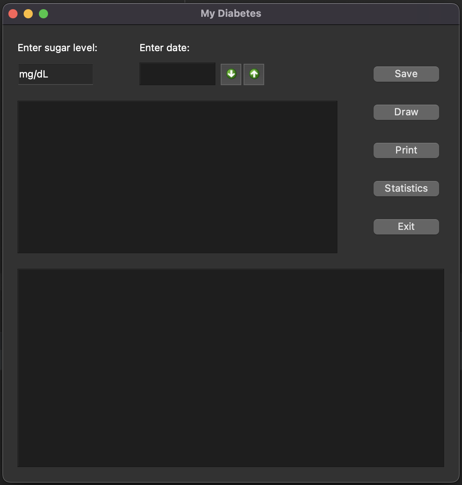
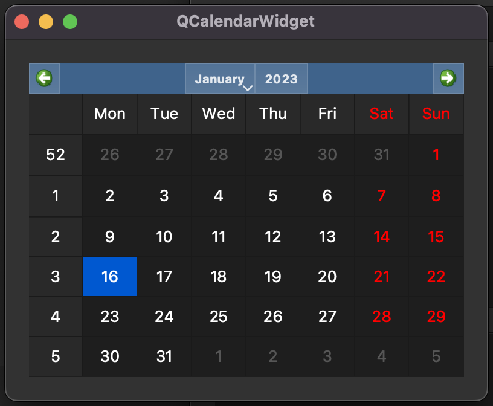
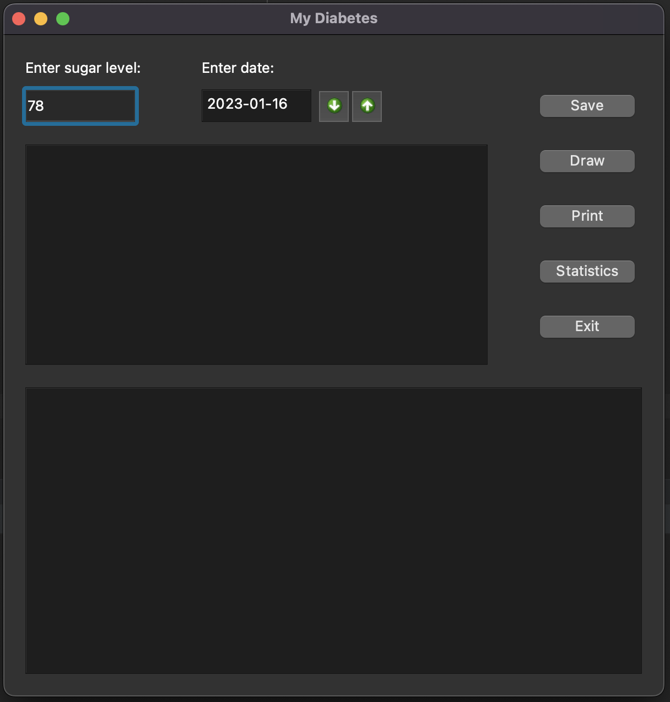
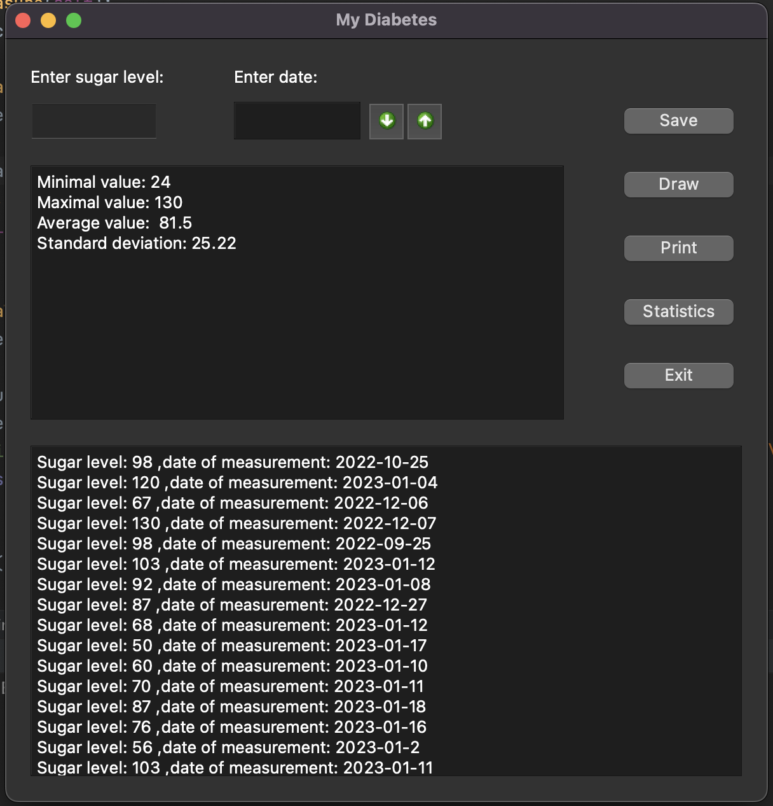
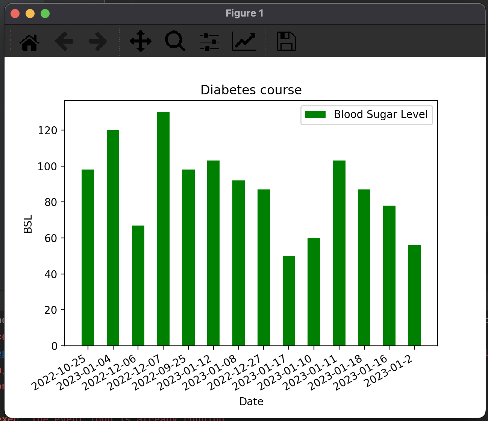
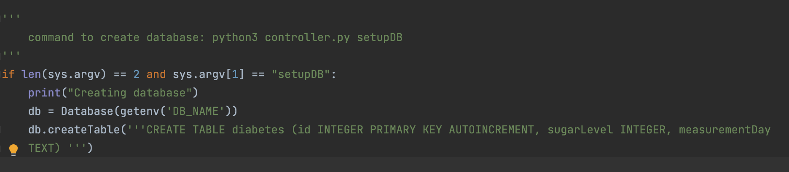
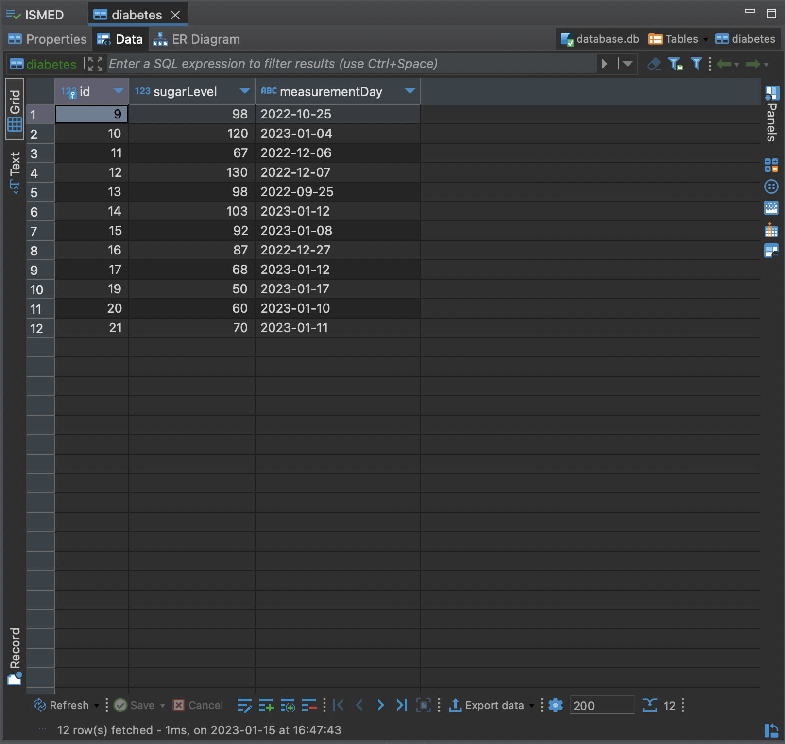

# Diabetic Diary in Python

## Application description 
Diabetes Diary. 
    The program is to allow the user to enter  results  of measurements 
    blood glucose levels along with the dates of their execution (date, time).
    It should also provide for the identification of basic statistics
    stored test results, including maximum, minimum, average
    and standard deviation. In case of going beyond the specified range, it has
    inform you of the need to inform your doctor. Data
    are stored in the database.
    
## Application window and operation
When you start the program, a main window appears in which you should keep the relevant data about your blood sugar level, the time and the date of your blood sugar measurement.
The program shows whether the measurement is included in the standard. It also analyzes the results and we get information about the maximum value, the mean and the standard deviation. It also prints all results entered by the user.

    

The blood sugar level is entered into the textField using the keyboard, the date is entered
is from the calendar opened with the down arrow button. After you select a date on the calendar
press the button with the up arrow. This leads the date to textArea.

    

    

The Print and Statistics buttons in the corresponding windows display the counted average, deviation,
the minimum and maximum values from the collected measurements and all measurements.

    

When you press the Draw button, you get a graph showing the results of the measurements.

    

Use the Exit button to end the program.

## Database creation and stored data
 If the dnaych database has not been created before, you can generate a new one using commands **python3 main.py setupDB**

    

The database with which the program was tested is one table. Contains three columns: unique id key, 
the sugar level and the third column shows the dates of the measurements.

    

## Installations needed to run the program

pip install pandas 
     pip install PySide2 
     pip install matplotlib

## Launching
The program (controller.py file) is run by IDE, or by typing in terminal command **python3 controller.py**
